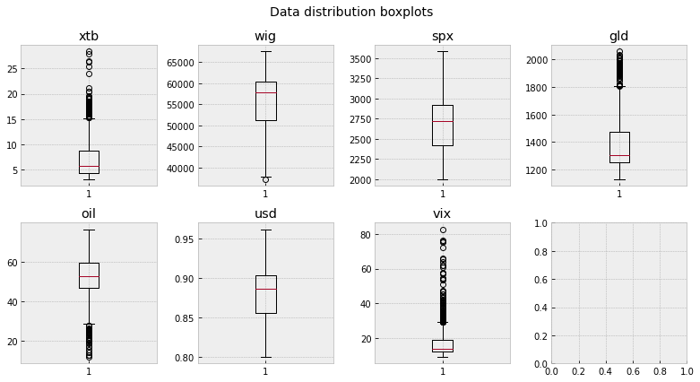
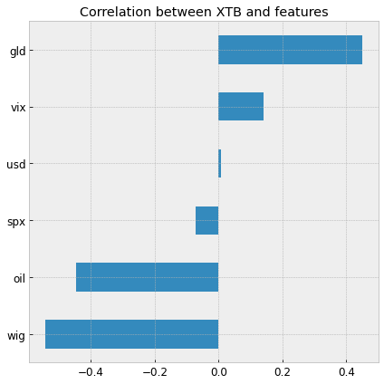
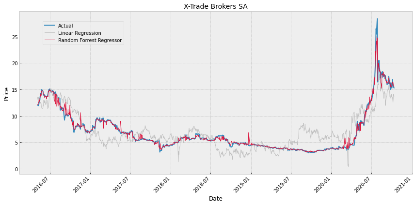

# Simple stock price estimator: project overview
___
- Created a model that predicts a next day price for XTB company's stock (R2= 0.965, RMSE=0.715).
- Feature selection based on domain knowledge of financial markets and the research about the company.
- Reviewing and combining several datasets that represent various financial instruments.
- Performed exploratory data analysis for a better understanding of underlying relations between features.
- Preprocessing the data and used multiple regression algorithms, from Linear Model to Random Forrest Regressor.
- Performing basic measurements and conducting cross-validation for better score verification.
___
### Code and resaurces used
- **Python version:** 3.8
- **Packages:** numpy,pandas, matplotlib, sklearn
- **Environment** Anaconda, Win64

### About the XTB company
With more than 15 years experience, <a href="https://www.xtb.com/int"><b>XTB</b></a> is one of the largest stock exchange-listed FX & CFD brokers in the world. It has offices in over 13 countries including UK, Poland, Germany, France and Chile. 

According to the company <a href="https://ir.xtb.com/en/reports/https://ir.xtb.com/en/reports/">financial reports</a>, its main profits come from FX, comodities, and CFD contracts. So, the more volatility on the global financial market, the better for the profits. Keeping that in mind, I choose some key fundamental indicators (indices) or possible underlying products (USD/EUR, gold, oil). That seems to be the most promising for my analysis. What is essential due to the different timezones is that some of them can be treated as leading indicators, which is beneficial for the practical application of such research.

### About the datasets
- <a href="https://stooq.pl/q/?s=xtb&c=mx&t=l&a=ln&b=0https://stooq.pl/q/?s=xtb&c=mx&t=l&a=ln&b=0">X-Trade Brokers SA (XTB)</a>
- <a href="https://stooq.pl/q/?s=wighttps://stooq.pl/q/?s=wig">WIG (WIG)</a>
- <a href="https://stooq.pl/q/?s=^spxhttps://stooq.pl/q/?s=^spx">S&P 500 U.S. (^SPX)</a>
- <a href="https://finance.yahoo.com/quote/%5EVIX?p=%5EVIXhttps://finance.yahoo.com/quote/%5EVIX?p=%5EVIX">CBOE Volatility Index (^VIX)CBOE Volatility Index (^VIX)</a>
- <a href="https://stooq.pl/q/?s=usdeurhttps://stooq.pl/q/?s=usdeur">U.S. Dollar / Euro 1:1 (USDEUR)</a>
- <a href="https://stooq.pl/q/?s=gc.fhttps://stooq.pl/q/?s=gc.f">Gold - COMEX (GC.F)</a>
- <a href="https://stooq.pl/q/?s=cl.fhttps://stooq.pl/q/?s=cl.f">Crude Oil WTI - NYMEX (CL.F)</a>

### Data cleaning
Was not needed since the data was clean and well organized.

### Exploratory data analysis
- EDA was an important part of the project and remained a valuable foundation for future model performance improvements. 
- The key message that comes directly from data suggests that traditional linear algorithms will have difficulties dealing with such skewed datasets, high variance, and common occurrence of outliers. It was a reason I chose and tried tree type algorithms as well. 
- There are some nonlinear relations between features that should be investigated in the future. Some data transformations will be needed for further model optimization. 

Below are a few highlights from the analysis.

 

### Model building
- The data were scaled using the sklearn StandardScaler and split into training and testing datasets (60/40). 
- I tried different models and evaluated them using R2 and RMSE. 
- While I suspect that using regressors such as Decision Tree and Random Forrest could be a good fit, I have also tested Linear Regression and, for pure curiosity Huber and Ridge regressors.

### Model performance 
The **Random Forest Regressor** (rfr) outperformed the other approaches on the test and validation data.

|     |       R2 |     RMSE |
|:----|---------:|---------:|
| rfr | `0.965555` | `0.712411` |
| dtr | 0.942541 | 0.920118 |
| hr  | 0.610065 | 2.39696  |
| rge | 0.609518 | 2.39864  |
| lr  | 0.608597 | 2.40147  |
